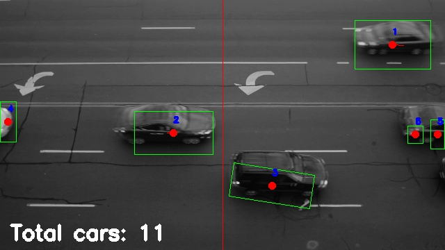
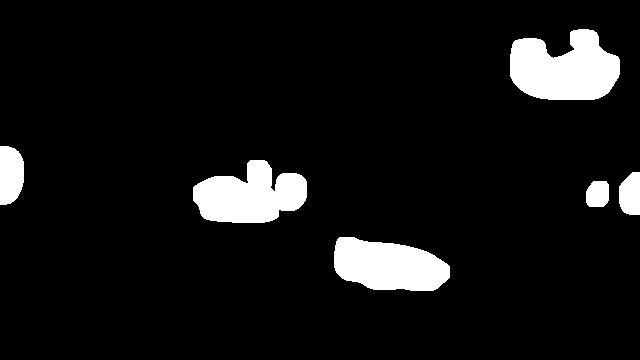
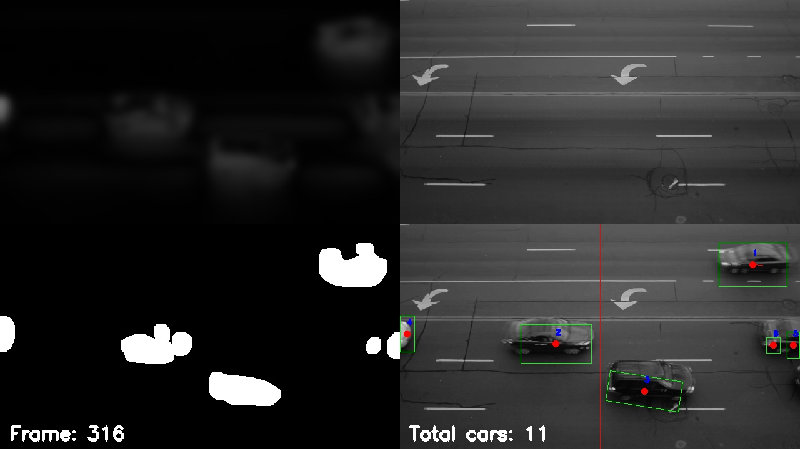
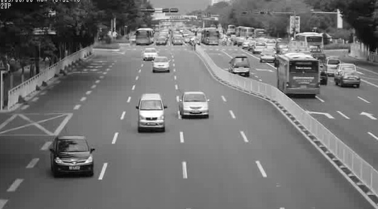
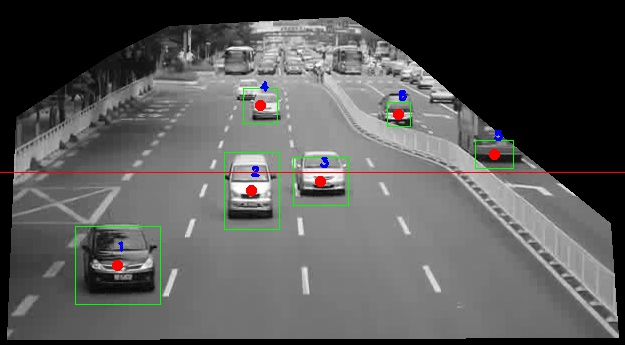

# Traffic Counter






This is the result of my undergraduate summer of research (2015) for the computer science department at Berea College. The OpenCV library is used to detect moving objects in a video feed by background subtraction and edge detection. 

No machine learning or fancy AI is being done here. This was mainly to keep the processing requirements low.

The system counts counts the number of cars passing the road. The project was developed on the original Raspberry Pi and therefore it needed to be fast to run. However, a faster device is recommended. 

The project was recently updated to use Python 3.7.8 and OpenCV 4.4.0.

You can check the paper report or the blog posts (links at the bottom) I made at the time to get a better idea about the motivation for the project.

## How to Set Up
The `requirements.txt` file contains the required libraries to run the script. It also contains other libraries like Jupyter notebook which is not really necessary. The main libraries and configurations needed are the following:

```
Python version: 3.7.8

OpenCV  4.4.0
Numpy   1.19.1
imutils 0.5.3
```

Installing OpenCV might be tricky depending on the system. Create a conda environment and install it in there. Maybe try running the command

```sh
conda install -c menpo opencv
```

## How to Use
There are several command line arguments that can given to the script. The information here might be outdated, so the safest way to check the available commands is by running:

```sh
python main.py --help
```

Which will return something like:

```
usage: main.py [-h] [-p PATH] [-a MINAREA] [-d DIRECTION DIRECTION]
               [-n NUMCOUNT] [-w WEBCAM [WEBCAM ...]] [--rgb] [-vo VIDEO_OUT]
               [-vw VIDEO_WIDTH] [-vp VIDEO_PARAMS VIDEO_PARAMS]
               [-sf STARTING_FRAME]

Finds the contours on a video file

optional arguments:
  -h, --help            show this help message and exit
  -p PATH, --path PATH  A video filename or path. Works better with .avi
                        files. If no path or name is provided, the camera will
                        be used instead.
  -a MINAREA, --minArea MINAREA
                        The minimum area (in pixels) to draw a bounding box
                        (default is 200)
  -d DIRECTION DIRECTION, --direction DIRECTION DIRECTION
                        A character: H or V representing the orientation of
                        the count line. H is horizontal, V is vertical. If not
                        provided, the default is H,0.5. The second parameter
                        is a float number from 0 to 1 indicating the place at
                        which the line should be drawn.
  -n NUMCOUNT, --numCount NUMCOUNT
                        The number of contours to be detected by the program
                        (default is 10).
  -w WEBCAM [WEBCAM ...], --webcam WEBCAM [WEBCAM ...]
                        Allows the user to specify which to use as the video
                        source
  --rgb                 Boolean flag to use rbg colors.
  -vo VIDEO_OUT, --video_out VIDEO_OUT
                        Provide a video filename to output
  -vw VIDEO_WIDTH, --video_width VIDEO_WIDTH
                        Videos will be resized to this width (default is 640).
                        Height will be computed automatically to preserve
                        aspect ratio
  -vp VIDEO_PARAMS VIDEO_PARAMS, --video_params VIDEO_PARAMS VIDEO_PARAMS
                        Provide video codec and extension (in that order) for
                        the output video. Example: `--video_params mjpg avi`.
                        Default values are mjpg avi
  -sf STARTING_FRAME, --starting_frame STARTING_FRAME
                        Select the starting frame for video analysis (default
                        is 10). All frames before that will still be used for
                        the background average

```

The most important argument is `-p` which gives the script the name of the file to analyze (use live camera video is not working yet). The flag `-d` is used to indicate the direction and position of the counting line. Like:

```sh
python main.py -p <path_to_your_video> -d v 0.5
```

The desired video width can also be provided with the flag `-vw`. This will also affect the size of the output video. 

```sh
python main.py -p <path_to_your_video> -vw 640
```

To get videos saved, use the flag `-vo` and some text that will be included in the output file's filename. For example:

```sh
python main.py -p <path_to_your_video> -vo my_video_without_extensions
```

Keep in mind that the default values for the file extension and video codec might not work for your system. Use tag `-vp` to change the default codec and extension combination. The codec is a 4-letter code (i.e. `MJPG`, `XDIV`, `DIVX`,etc). The extension can be something like `avi`, `mp4`, etc. For example:

```sh
python main.py -p <path_to_your_video> -vo some_video_name -vp MJPG avi
```

While the video windows are open, you can press `s` to save a screenshot at that particular frame. Pressing spacebar will pause the video (press spacebar again to resume).

## Interface
I have updated the project and moved away from the original script. In the new one, the computer vision parts are handled in a class TrafficCoutner in traffic_counter.py. To run the script, you must run main.py with a combination of parameters. For example:

```sh
python main.py -p <path_to_your_video> -d V 0.5 
```

There are other parameters that can be modified, but as of now, I have not included a way to change them once the script starts. 

Once the script runs, a frame from the video will be displayed and you can click on several points on the frame to select an area of interest to calculate. Everything outside the selected area will be ignored. To proceed to the next part, press `q` or `enter` on the keyboard.




## Blog Post

As part of the research requirements, I wrote blog posts describing the progress made each week. It can be found
at:

[blog series](https://andrescscresearch.wordpress.com/)

## Paper Draft

A paper report of the work is also included in the repository:


[PaperReport_traffic_counter.pdf](./PaperReport_traffic_counter.pdf)

## Other links
I created a nice YouTube video explaining the project. Watch it below:

- [Build a Traffic Counter With Python](https://youtu.be/_UGCBud63Eo)

I encourage you to subscribe to the channel to get notified when I post about new projects.
